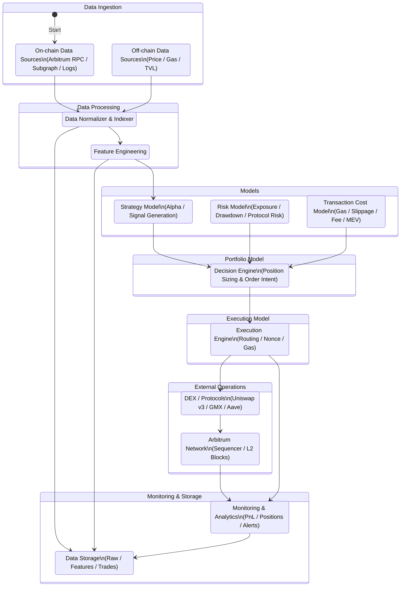

# Flow Chart

```mermaid
stateDiagram-v2
    %% ===== Data Ingestion =====
    state "Data Ingestion" as DataIngestion {
        [*] --> OnChainData : Start
        OnChainData : On-chain Data Sources\n(Arbitrum RPC / Subgraph / Logs)
        OffChainData : Off-chain Data Sources\n(Price / Gas / TVL)
    }

    %% ===== Data Processing =====
    state "Data Processing" as DataProcessing {
        DataNormalizer : Data Normalizer & Indexer
        FeatureEngineering : Feature Engineering
        DataNormalizer --> FeatureEngineering
    }

    %% ===== Models =====
    state "Models" as Models {
        StrategyModel : Strategy Model\n(Alpha / Signal Generation)
        RiskModel : Risk Model\n(Exposure / Drawdown / Protocol Risk)
        TransactionCostModel : Transaction Cost Model\n(Gas / Slippage / Fee / MEV)
    }


    %% ===== Portfolio Model =====
    state "Portfolio Model" as PortfolioModel {
        DecisionEngine : Decision Engine\n(Position Sizing & Order Intent)
    }

    %% ===== Execution Model =====
    state "Execution Model" as ExecutionModel {
        ExecutionEngine : Execution Engine\n(Routing / Nonce / Gas)
    }

    DecisionEngine --> ExecutionEngine

    %% ===== External Operations =====
    state "External Operations" as ExternalOps {
        DEXProtocols : DEX / Protocols\n(Uniswap v3 / GMX / Aave)
        ArbitrumNetwork : Arbitrum Network\n(Sequencer / L2 Blocks)

        DEXProtocols --> ArbitrumNetwork
    }

    %% ===== Monitoring & Storage =====
    state "Monitoring & Storage" as MonitoringStorage {
        Monitoring : Monitoring & Analytics\n(PnL / Positions / Alerts)
        Storage : Data Storage\n(Raw / Features / Trades)
    }

    %% ===== Flow Connections =====
    OnChainData --> DataNormalizer
    OffChainData --> DataNormalizer
    FeatureEngineering --> StrategyModel

    StrategyModel --> DecisionEngine
    RiskModel --> DecisionEngine
    TransactionCostModel --> DecisionEngine

    ExecutionEngine --> DEXProtocols

    ArbitrumNetwork --> Monitoring
    ExecutionEngine --> Monitoring

    DataNormalizer --> Storage
    FeatureEngineering --> Storage
    Monitoring --> Storage
```
